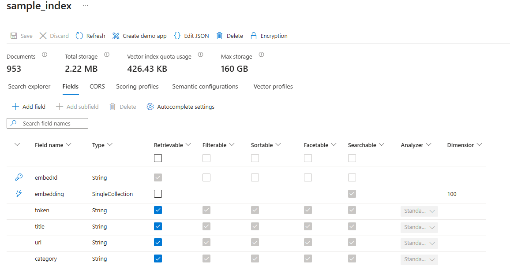

# Sample using agents with Azure AI Search tool in Azure.AI.Agents.Persistent.

Azure AI Search is an enterprise search system for high-performance applications.
It integrates with Azure OpenAI Service and Azure Machine Learning, offering advanced
search technologies like vector search and full-text search. Ideal for knowledge base
insights, information discovery, and automation. Creating an agent with Azure AI
Search requires an existing Azure AI Search Index. For more information and setup
guides, see [Azure AI Search Tool Guide](https://learn.microsoft.com/azure/ai-services/agents/how-to/tools/azure-ai-search).
In this example we will use the existing Azure AI Search Index as a tool for an agent.

1. First we need to read the environment variables, which will be used in the next steps.
```C# Snippet:AgentsAzureAISearchExample_CreateProjectClient
var projectEndpoint = System.Environment.GetEnvironmentVariable("PROJECT_ENDPOINT");
var modelDeploymentName = System.Environment.GetEnvironmentVariable("MODEL_DEPLOYMENT_NAME");
var connectionID = System.Environment.GetEnvironmentVariable("AZURE_AI_CONNECTION_ID");
```

2. Create an agent with `AzureAISearchToolDefinition` and `ToolResources` with the only member `AzureAISearchResource` to be able to perform search. We will use `connectionID` to get the Azure AI Search resource. These tools and tool resources will be supplied to `CreateAgent` method.

Synchronous sample:
```C# Snippet:AgentsCreateAgentWithAzureAISearchTool_Sync
AzureAISearchToolResource searchResource = new(
    connectionID,
    "sample_index",
    5,
    "category eq 'sleeping bag'",
    AzureAISearchQueryType.Simple
);
ToolResources toolResource = new()
{
    AzureAISearch = searchResource
};

PersistentAgentsClient client = new(projectEndpoint, new DefaultAzureCredential());

// NOTE: To reuse existing agent, fetch it with client.Administration.GetAgent(agentId)
PersistentAgent agent = client.Administration.CreateAgent(
   model: modelDeploymentName,
   name: "my-agent",
   instructions: "You are a helpful agent capable to perform Azure AI Search using attached resources.",
   tools: [new AzureAISearchToolDefinition()],
   toolResources: toolResource);
```

Asynchronous sample:
```C# Snippet:AgentsCreateAgentWithAzureAISearchTool
AzureAISearchToolResource searchResource = new(
    connectionID,
    "sample_index",
    5,
    "category eq 'sleeping bag'",
    AzureAISearchQueryType.Simple
);
ToolResources toolResource = new()
{
    AzureAISearch = searchResource
};

PersistentAgentsClient client = new(projectEndpoint, new DefaultAzureCredential());

// NOTE: To reuse existing agent, fetch it with client.Administration.GetAgent(agentId)
PersistentAgent agent = await client.Administration.CreateAgentAsync(
   model: modelDeploymentName,
   name: "my-agent",
   instructions: "You are a helpful agent capable to perform Azure AI Search using attached resources.",
   tools: [ new AzureAISearchToolDefinition() ],
   toolResources: toolResource);
```

3. Now we will create a run and wait until it is complete. If the run will not be successful, we will print the last error.

Synchronous sample:
```C# Snippet:AgentsAzureAISearchExample_CreateRun_Sync
// Create thread for communication
PersistentAgentThread thread = client.Threads.CreateThread();

// Create message to thread
PersistentThreadMessage message = client.Messages.CreateMessage(
    thread.Id,
    MessageRole.User,
    "What is the temperature rating of the cozynights sleeping bag?");

// Run the agent
Response<ThreadRun> runResponse = client.Runs.CreateRun(thread, agent);

do
{
    Thread.Sleep(TimeSpan.FromMilliseconds(500));
    runResponse = client.Runs.GetRun(thread.Id, runResponse.Value.Id);
}
while (runResponse.Value.Status == RunStatus.Queued
    || runResponse.Value.Status == RunStatus.InProgress);

Assert.AreEqual(
    RunStatus.Completed,
    runResponse.Value.Status,
    runResponse.Value.LastError?.Message);
```

Asynchronous sample:
```C# Snippet:AgentsAzureAISearchExample_CreateRun
// Create thread for communication
PersistentAgentThread thread = await client.Threads.CreateThreadAsync();

// Create message to thread
PersistentThreadMessage message = await client.Messages.CreateMessageAsync(
    thread.Id,
    MessageRole.User,
    "What is the temperature rating of the cozynights sleeping bag?");

// Run the agent
ThreadRun run = await client.Runs.CreateRunAsync(thread, agent);

do
{
    await Task.Delay(TimeSpan.FromMilliseconds(500));
    run = await client.Runs.GetRunAsync(thread.Id, run.Id);
}
while (run.Status == RunStatus.Queued
    || run.Status == RunStatus.InProgress);

Assert.AreEqual(
    RunStatus.Completed,
    run.Status,
    run.LastError?.Message);
```

4. In our search we have used an index containing "embedding", "token", "category", "title" and "url" fields as shown in the image.  The last two fields are needed to get citation title and url, retrieved by the agent. In the code below, we iterate messages in chronological order and replace the reference placeholders by url and title.

Synchronous sample:
```C# Snippet:AgentsPopulateReferencesAgentWithAzureAISearchTool_Sync
Pageable<PersistentThreadMessage> messages = client.Messages.GetMessages(
    threadId: thread.Id,
    order: ListSortOrder.Ascending
);

foreach (PersistentThreadMessage threadMessage in messages)
{
    Console.Write($"{threadMessage.CreatedAt:yyyy-MM-dd HH:mm:ss} - {threadMessage.Role,10}: ");
    foreach (MessageContent contentItem in threadMessage.ContentItems)
    {
        if (contentItem is MessageTextContent textItem)
        {
            // We need to annotate only Agent messages.
            if (threadMessage.Role == MessageRole.Agent && textItem.Annotations.Count > 0)
            {
                string annotatedText = textItem.Text;
                foreach (MessageTextAnnotation annotation in textItem.Annotations)
                {
                    if (annotation is MessageTextUriCitationAnnotation uriAnnotation)
                    {
                        annotatedText = annotatedText.Replace(
                            uriAnnotation.Text,
                            $" [see {uriAnnotation.UriCitation.Title}] ({uriAnnotation.UriCitation.Uri})");
                    }
                }
                Console.Write(annotatedText);
            }
            else
            {
                Console.Write(textItem.Text);
            }
        }
        else if (contentItem is MessageImageFileContent imageFileItem)
        {
            Console.Write($"<image from ID: {imageFileItem.FileId}");
        }
        Console.WriteLine();
    }
}
```

Asynchronous sample:
```C# Snippet:AgentsPopulateReferencesAgentWithAzureAISearchTool
AsyncPageable<PersistentThreadMessage> messages = client.Messages.GetMessagesAsync(
    threadId: thread.Id,
    order: ListSortOrder.Ascending
);

await foreach (PersistentThreadMessage threadMessage in messages)
{
    Console.Write($"{threadMessage.CreatedAt:yyyy-MM-dd HH:mm:ss} - {threadMessage.Role,10}: ");
    foreach (MessageContent contentItem in threadMessage.ContentItems)
    {
        if (contentItem is MessageTextContent textItem)
        {
            // We need to annotate only Agent messages.
            if (threadMessage.Role == MessageRole.Agent && textItem.Annotations.Count > 0)
            {
                string annotatedText = textItem.Text;
                foreach (MessageTextAnnotation annotation in textItem.Annotations)
                {
                    if (annotation is MessageTextUriCitationAnnotation uriAnnotation)
                    {
                        annotatedText = annotatedText.Replace(
                            uriAnnotation.Text,
                            $" [see {uriAnnotation.UriCitation.Title}] ({uriAnnotation.UriCitation.Uri})");
                    }
                }
                Console.Write(annotatedText);
            }
            else
            {
                Console.Write(textItem.Text);
            }
        }
        else if (contentItem is MessageImageFileContent imageFileItem)
        {
            Console.Write($"<image from ID: {imageFileItem.FileId}");
        }
        Console.WriteLine();
    }
}
```

5. Finally, delete all the resources, we have created in this sample.

Synchronous sample:
```C# Snippet:AgentsAzureAISearchExample_Cleanup_Sync
// NOTE: Comment out these two lines if you plan to reuse the agent later.
client.Threads.DeleteThread(thread.Id);
client.Administration.DeleteAgent(agent.Id);
```

Asynchronous sample:
```C# Snippet:AgentsAzureAISearchExample_Cleanup
// NOTE: Comment out these two lines if you plan to reuse the agent later.
await client.Threads.DeleteThreadAsync(thread.Id);
await client.Administration.DeleteAgentAsync(agent.Id);
```
